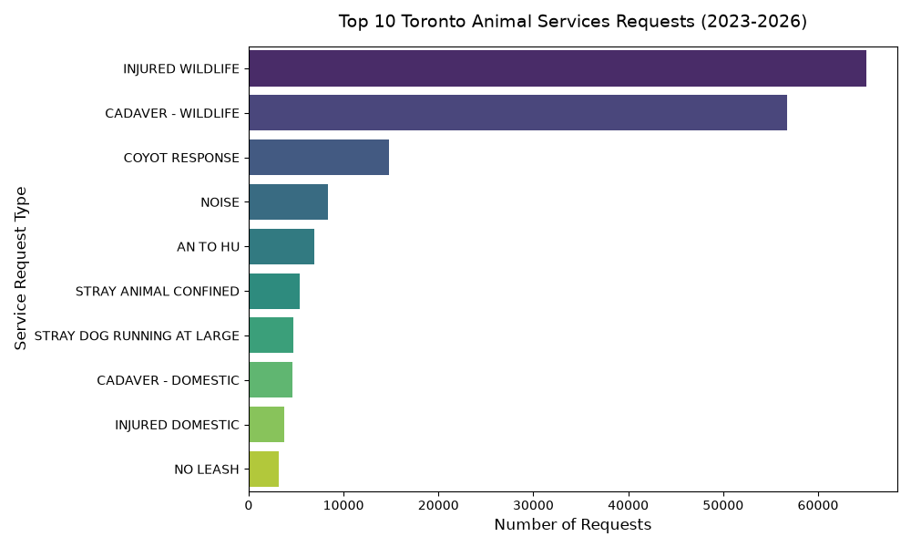
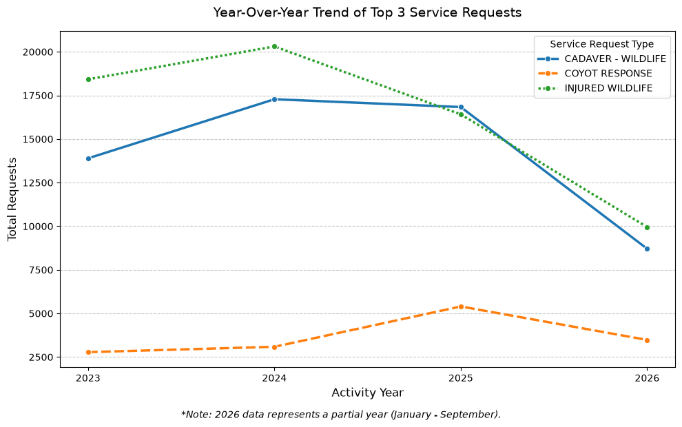

# Toronto Animal Services: Service Demand Analysis

## Objective

This project analyzes operational service-request data from Toronto Animal Services to identify service-demand patterns and compare activity between Mobile Response and Enforcement. The analysis also examines trends in wildlife-related requests over time.

## Data Source

Data was obtained from the Toronto Open Data Portal's Service Requests & Complaints dataset. The dataset contains more than 196,000 recorded service requests from 2023 through 2026.

## Methodology

A Python and pandas workflow was used to prepare and analyze the data:

1. **Data Validation & Cleaning:** Inspected the dataset structure, reviewed missing values, and cleaned records used in the analysis.
2. **Transformation:** Created analytical groupings and time-based summaries to support comparisons across years and service-request categories.
3. **Analysis:** Examined request volumes by operational area, service-request type, and year to identify notable patterns.
4. **Visualization:** Used Matplotlib and Seaborn to visualize service-demand trends and category distributions.

## Key Findings

### 1. Mobile Response accounts for the majority of recorded requests

Mobile Response accounted for 79.9% of recorded requests, compared with 20.1% for Enforcement. This highlights a substantial difference in service-request volume between the two operational areas and provides a starting point for examining differences in operational demand.

### 2. Wildlife-related requests are a major driver of service demand

"Injured Wildlife" and "Cadaver - Wildlife" were among the highest-volume service-request types in the dataset. This indicates that wildlife response represents a significant component of Toronto Animal Services' recorded service activity.

### 3. Coyote Response requests increased in 2025

Coyote Response requests increased significantly in 2025 despite an overall normalization in wildlife-related requests. This pattern warrants further investigation using additional geographic or environmental data to understand the factors contributing to the increase.

## Data Limitations

- **Partial Year:** 2026 data covers January through September and therefore should not be directly compared with complete calendar years without accounting for the difference in observation periods.
- **Request Volume vs. Workload:** The number of recorded requests does not directly measure staff time, operational cost, or case complexity. Request volume should therefore not be interpreted as a direct measure of resource requirements.
- **Scope of Data:** The dataset represents service requests responded to by Toronto Animal Services and does not necessarily capture all animal-related incidents or demand for animal services in Toronto.

## Technologies

- **Python:** pandas, NumPy
- **Visualization:** Matplotlib, Seaborn
- **Development:** Jupyter Notebook, VS Code
- **Version Control:** Git, GitHub